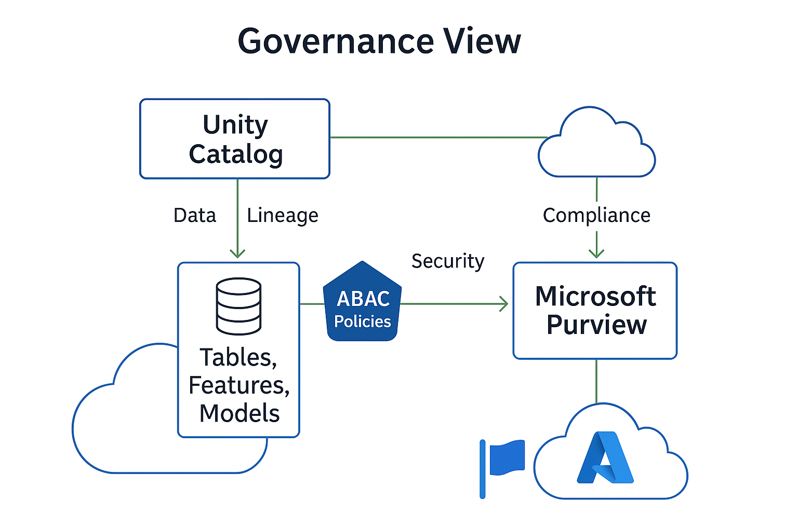
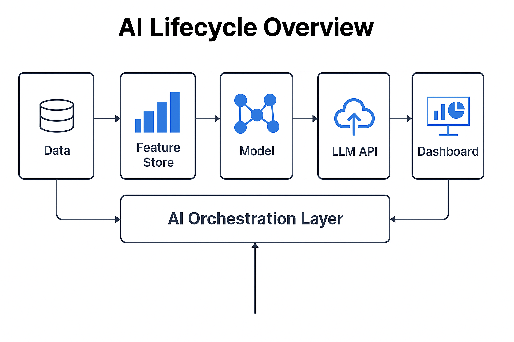
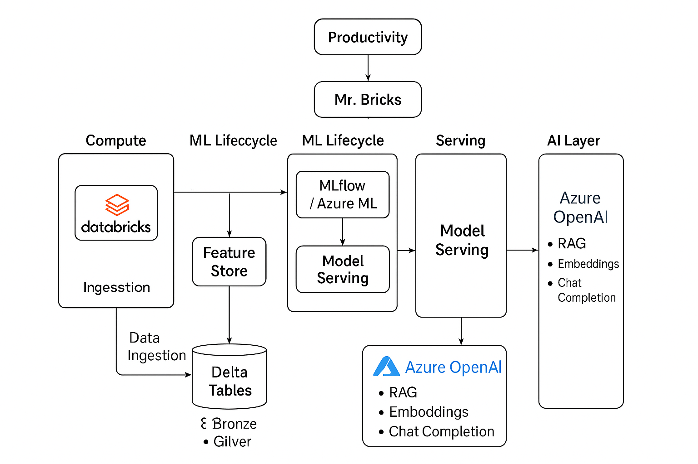
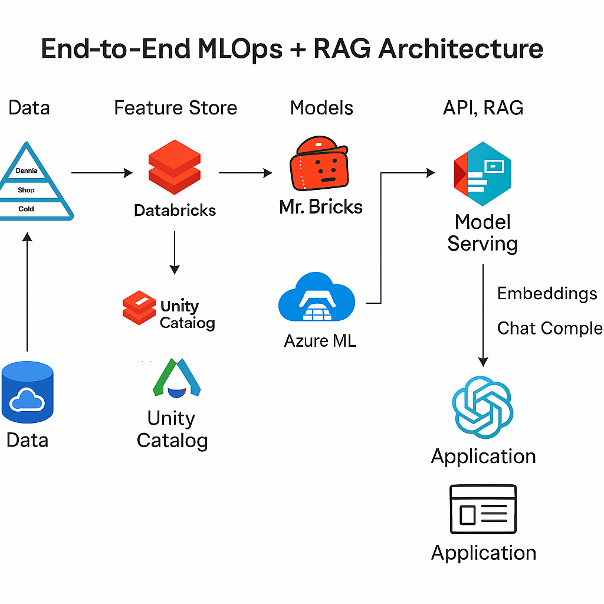

# 🧠 AI Architect Portfolio – Bruce Lanskiy

> End-to-end AI / ML / LLM systems: data → models → APIs → MLOps → AI-driven analytics on **Azure** and **Databricks Lakehouse**.

This repository captures my **4-month intensive journey** to master AI Architecture — focusing on **LLMs, MLOps, Databricks AI, and Cloud Data Governance**.

Target roles: **AI Architect / Principal Solutions Architect / ML Platform Engineer** at **Microsoft Azure, Meta, NVIDIA, Tesla, and similar enterprises.**

---

## 📚 Repository Structure

| Folder | Description |
|--------|--------------|
| [`roadmap/`](./roadmap/) | 4-month learning plan & checklist. |
| [`notes/`](./notes/) | Conceptual summaries (ML, DL, LLMs, Azure ML, Databricks AI). |
| [`projects/`](./projects/) | Hands-on projects and capstones (from classical ML → LLMs → Databricks AI). |
| [`environment/`](./environment/) | Environment files (`requirements*.txt`, cluster configs). |
| [`assets/`](./assets/) | Architecture diagrams & portfolio visuals. |

---

## 🧩 Phase 1 – Month 1: Core ML Foundations
**Key Skills:** Scikit-learn, model evaluation, reproducibility.  
**Projects:**
- `01-ml-basics` – regression & classification fundamentals  
- `02-deep-learning-cnn` – build & train MLP/CNN with GPU benchmarking  

Deliverables: `ml_basics.ipynb`, `cnn_transfer_learning.ipynb`

---

## 🤖 Phase 2 – Month 2: NLP & LLMs on Azure
**Key Skills:** Transformers, Hugging Face, OpenAI/Azure OpenAI, embeddings, LangChain.  
**Projects:**
- `03-nlp-transformers` – pre-trained transformers  
- `04-huggingface-finetuning` – fine-tuning text classifier  
- `05-llm-embeddings` – embeddings & vector search  
- `06-langchain-rag` – Retrieval-Augmented Generation prototype  

Deliverables: `hf_finetune_text_classification.ipynb`, `rag_langchain_demo.ipynb`

---

## 🧱 Phase 3 – Month 3: MLOps & Productionization
**Key Skills:** Azure ML, MLflow, Model Registry, CI/CD, GPU optimization.  
**Projects:**
- `07-azure-ml-mlops-demo` – model train → register → deploy → monitor  
- `09-capstone-mlops-churn-prediction` – classical ML project with full MLOps pipeline  

Deliverables: `mlops_azureml_demo.ipynb`, `churn_mlops_project/`

---

## ☁️ Phase 4 – Month 4: Databricks AI + Mr. Bricks Assistant

**Goal:** Learn and apply Databricks AI capabilities integrated with Azure OpenAI and the Databricks Lakehouse.

### 🔹 10. Databricks AI Overview
- Learn the **Lakehouse AI stack** – Delta, Unity Catalog, MLflow, Feature Store, Model Serving.  
- Understand the new **Mr. Bricks AI Assistant** for intelligent code generation & pipeline debugging.

Deliverable: `Databricks_AI_Overview.md`

---

### 🔹 11. Mr. Bricks Hands-On
- Use **Mr. Bricks** for:
  - Code completion in Databricks notebooks  
  - Auto-generation of ETL queries & DLT pipelines  
  - Suggesting optimizations for performance and cost  

Deliverable: `mr_bricks_demo.ipynb`

---

### 🔹 12. Databricks + Azure OpenAI Integration
- Connect Databricks notebooks to **Azure OpenAI Service**.  
- Generate embeddings, automate insight generation, and build AI-assisted data processing flows.  

Deliverable: `databricks_openai_integration.ipynb`

---

### 🔹 13. Databricks Model Serving
- Deploy and test an ML model as a REST endpoint inside Databricks.  
- Compare with Azure ML online endpoints for latency and scaling patterns.  

Deliverable: `databricks_model_serving_demo.ipynb`

---

### 🔹 14. Feature Store & Unity Catalog Governance
- Use **Feature Store** to create reusable features for training and inference.  
- Apply **Unity Catalog** for fine-grained data access and lineage tracking (ABAC style).  

Deliverables: `feature_store_demo.ipynb`, `unity_catalog_governance.md`
#### 🧭 Governance View: Unity Catalog + Purview + ABAC

The diagram below shows how Unity Catalog, Microsoft Purview, and ABAC policies work together to provide
**centralized data governance, lineage, and fine-grained access control** across Databricks, Azure ML, and Power BI.


<sub>
This governance architecture illustrates how **Unity Catalog** acts as the central control plane for all
data, ML, and AI assets across the Lakehouse, enforcing **attribute-based access control (ABAC)** policies 
for fine-grained permissions. **Microsoft Purview** complements it by providing **enterprise-wide data 
discovery, lineage, and classification**, ensuring regulatory compliance and visibility from ingestion to 
analytics. Together, Unity Catalog + Purview establish an **end-to-end governance fabric** that secures data
flows across **Databricks, Azure ML, and Power BI**, aligning with modern **zero-trust and data sovereignty principles**.
</sub>

---

### 🔹 15. Capstone Project #3 – Databricks AI Integration
**Objective:**  
Build an end-to-end AI pipeline combining **Databricks**, **Azure OpenAI**, and **Mr. Bricks** to automatically curate data, generate summaries, and serve insights through a model endpoint.

**Stack:**  
Databricks + Delta + Unity Catalog + Feature Store + Azure OpenAI + LangChain


<sub>
The AI Orchestration Layer connects data pipelines, model lifecycle, and LLM interfaces into a unified feedback loop — 
enabling continuous learning and intelligence from **data → model → insight → action**.
</sub>

Deliverables:
- `capstone_databricks_ai_project/`
- Architecture diagram: `diagrams/databricks_ai_architecture.png`

<sub>
This diagram shows how **Databricks Lakehouse AI** unifies data ingestion, Delta processing, and ML workflows
within a single platform. **Mr. Bricks** accelerates development through intelligent code suggestions and pipeline automation,
while **Feature Store**, **Model Serving**, and **Unity Catalog** enable a governed, end-to-end AI lifecycle from raw data to deployed model.
</sub>
---
### ☁️ End-to-End AI Architecture (Azure ML + Databricks + OpenAI)

Below is a high-level architecture connecting Azure ML, Databricks, and Azure OpenAI for data → model → API → insights workflow.


<sub>
This end-to-end pipeline illustrates seamless integration between **Azure ML**, **Databricks**, and **Azure OpenAI**.
Data flows from **ADLS** into Databricks for transformation and feature engineering, with models trained and tracked in **MLflow** and deployed via **Azure ML endpoints**.
**Azure OpenAI** adds LLM capabilities — embeddings, RAG, and generative APIs — extending analytics into intelligent applications and dashboards.
</sub>
## 🧠 Notes
See [`notes/`](./notes/) for conceptual summaries:
- `databricks_ai_notes.md` – overview of Databricks AI platform
- `mr_bricks_tips.md` – advanced usage of Mr. Bricks assistant
- `unity_catalog_governance.md` – data governance patterns
- `feature_store_concepts.md` – operational feature management

---

## 🛠️ Tech Stack

**Languages & Libraries**
- Python, PySpark, SQL, PyTorch, TensorFlow, scikit-learn  
- Hugging Face, OpenAI API, LangChain, MLflow  

**Cloud & MLOps**
- **Azure:** Azure ML, Azure OpenAI, Cognitive Search  
- **Databricks:** DLT, Mr. Bricks, Model Serving, Unity Catalog, Feature Store  
- **GPU & Performance:** NVIDIA CUDA, multi-GPU training awareness  

---

## ▶️ How to Run

```bash
git clone https://github.com/<your-username>/ai-architect-portfolio.git
cd ai-architect-portfolio
python -m venv .venv
source .venv/bin/activate  # (Windows: .venv\Scripts\activate)
pip install -r environment/requirements.txt
